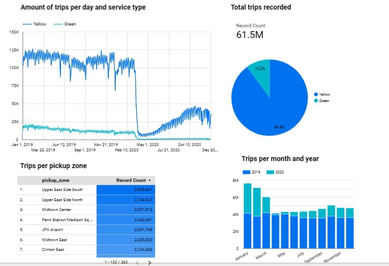

# Analytics Engineering

Goal: Transforming the data loaded in DWH into Analytical Views developing a dbt project.

### Prerequisites

- A running warehouse (BigQuery or postgres) 
- A set of running pipelines ingesting the project dataset (week 3 completed)
- The following datasets ingested from the course [Datasets list](https://github.com/DataTalksClub/nyc-tlc-data/): 
  * Yellow taxi data - Years 2019 and 2020
  * Green taxi data - Years 2019 and 2020 
  * fhv data - Year 2019. 

  ## 1. Set up environment

  Set up dbt for using BigQuery (cloud) following the instructions in [dbt_cloud_setup.md](dbt_cloud_setup.md).

  ## 2. Develop dbt models

  ### Workflow
  

Staging models:
- [`schema.yml`](taxi_rides_ny/models/staging/schema.yml): define the sources, database, schema and tables.
- [`stg_green_tripdata.sql`](taxi_rides_ny/models/staging/stg_green_tripdata.sql): defines a SQL query that transforms and materializes data from a source table (green_tripdata) into a view in the database.

Macros:
- [`get_payment_type_description.sql`](taxi_rides_ny/macros/get_payment_type_description.sql)

Seeds:
- [``taxi_zone_lookup.csv`](taxi_rides_ny/seeds/`taxi_zone_lookup.csv)

Core models:
- [`dim_zones.sql`](taxi_rides_ny/models/core/dim_zones.sql): define zone information where the taxis operate
- [`fact_trips.sql`](taxi_rides_ny/models/core/fact_trips.sql): combine the green and yellow trip data, encase it with dimensional data, and materialize it as a table.
- [`dm_monthly_zone_revenue.sql`](taxi_rides_ny/models/core/dm_monthly_zone_revenue.sql): creates a table summarizing revenue-related metrics for trips data

The dbt project looks like this:

  ## 3. Build the model

  1. Change into the project's directory from the command line: `$ cd [..]/taxi_rides_ny`
2. Load the CSVs into the database. This materializes the CSVs as tables in your target schema: `$ dbt seed`
3. Run the models: `$ dbt run`
4. Test your data: `$ dbt test`
_Alternative: use `$ dbt build` to execute with one command the 3 steps above together_
5. Generate documentation for the project: `$ dbt docs generate`
6. View the documentation for the project, this step should open the documentation page on a webserver, but it can also be accessed from  http://localhost:8080 : `$ dbt docs serve`

  ## 4. Test and document dbt models

  ## 5. Visualize the transformed data

  

