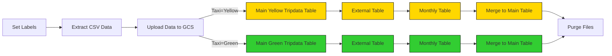

# Workflow Orchestration 

In this section, an ETL data pipeline will be created for:

- Extract data from the web. 
- Convert the CSV file into parquet.
- Upload to Google Cloud Storage.  
- Create an external table in Google BigQuery. 

## 1. Extract data from CSV files

### a. Setup Kestra

Run the following command to start up your instance:

```
docker run --pull=always --rm -it -p 8080:8080 --user=root \
  -v /var/run/docker.sock:/var/run/docker.sock \
  -v /tmp:/tmp kestra/kestra:latest server local
```

Head over to your browser and open https://localhost:8080 to launch the interface.

Then run

```
cd Workflow Orchestration/docker
docker compose up -d
```

### b. Setup Google Cloud Platform (GCP)

First, adjust the following flow [`gcp_kv.yaml`](flows/gcp_kv.yaml) to include your service account, GCP project ID, BigQuery dataset and GCS bucket name:
- GCP_CREDS
- GCP_PROJECT_ID
- GCP_LOCATION
- GCP_BUCKET_NAME
- GCP_DATASET.

Then create the GCS bucket and BigQuery dataset [`gcp_setup.yaml`](flows/gcp_setup.yaml). 

### c. Load Taxi Data to BigQuery



The flow code: [`06_gcp_taxi.yaml`](flows/gcp_taxi.yaml).

We can now schedule the same pipeline shown above to run daily at 9 AM UTC for the green dataset and at 10 AM UTC for the yellow dataset. 

The flow code: [`06_gcp_taxi_scheduled.yaml`](flows/gcp_taxi_scheduled.yaml).
